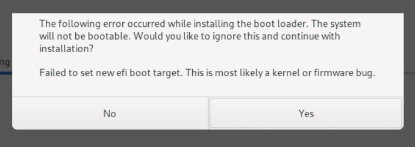

# mbp-fedora

[](https://travis-ci.com/mikeeq/mbp-fedora)

Fedora ISO with Apple T2 patches built-in (Macbooks produced >= 2018).

All available Apple T2 drivers are integrated with this iso. Most things work, besides those mentioned in [not working section](#not-working).

Kernel - <https://github.com/mikeeq/mbp-fedora-kernel>

Drivers:

- Apple T2 (audio, keyboard, touchpad) - <https://github.com/MCMrARM/mbp2018-bridge-drv>
- Apple SMC - <https://github.com/MCMrARM/mbp2018-etc>
- Touchbar - <https://github.com/roadrunner2/macbook12-spi-driver/tree/mbp15>

> Tested on: Macbook Pro 15,2 13" 2019 i5 TouchBar Z0WQ000AR MV972ZE/A/R1

```
Boot ROM Version:	220.270.99.0.0 (iBridge: 16.16.6571.0.0,0)
macOS Mojave: 10.14.6 (18G103)
```

## How to install

- Turn off secure boot - <https://support.apple.com/en-us/HT208330>
- Download .iso from releases section - <https://github.com/mikeeq/mbp-fedora/releases/latest>
  - If it's splitted into multiple zip parts, you need to join splitted files into one and then extract it via `unzip` or extract them directly via `7z x` or `7za x`
    - <https://unix.stackexchange.com/questions/40480/how-to-unzip-a-multipart-spanned-zip-on-linux>
- Burn the image on USB stick >=8GB via:
  - dd - `dd bs=4M if=/home/user/Downloads/livecd-fedora-mbp-201908181858.iso of=/dev/sdc conv=fdatasync status=progress`
  - rufus (GPT)- <https://rufus.ie/>
  - fedora media writer (custom image option)- <https://getfedora.org/en/workstation/download/>
  - don't use `livecd-iso-to-disk`, because it's overwriting grub settings
- Install Fedora
  - Boot directly from macOS boot manager. (You can boot into it by pressing and holding option key after clicking the power-on button).
    - There will be three boot options available, usually the third one works for me. (There are three of them, because there are three partitions in ISO: 1) ISO9660: with installer data, 2) fat32, 3) hfs+)
  - I recommend to shrink (resize) macOS APFS partition and not removing macOS installation entirely from your MacBook, because it's the only way to keep your device up-to-date. macOS OS updates also contains security patches to EFI/Apple T2
    - HowTo: <https://www.anyrecover.com/hard-drive-recovery-data/resize-partition-mac/> # Steps to Resize Mac Partition
  - You should use standard partition layout during partitioning your Disk in anaconda, because i haven't tested LVM scenario yet. <https://github.com/mikeeq/mbp-fedora/issues/2>
    - /boot/efi - 1024MB Linux HFS+ ESP
    - /boot - 1024MB EXT4
    - / - xxxGB EXT4
  - There will be an error on `Installing bootloader...` step, click Yes - It's related to `efi=noruntime` kernel arg
  
  ```
  # /tmp/anaconda.log
  13:39:49,173 INF bootloader.grub2: bootloader.py: used boot args: resume=UUID=8a64abbd-b1a3-4d4a-85c3-b73800e46a1e rd.lvm.lv=fedora_localhost-live/root rd.lvm.lv=fedora_localhost-live/swap rhgb quiet
  13:39:54,649 ERR bootloader.installation: bootloader.write failed: Failed to set new efi boot target. This is most likely a kernel or firmware bug.
  ```

- Put wifi firmware files to `/lib/firmware/brcm/`
  - tutorial - <https://github.com/mikeeq/mbp-fedora-kernel/#working-with-mbp-fedora-kernel>
- To install additional languages, install appropriate langpack via dnf `dnf search langpack`
- After login you can update kernel by running `sudo update_kernel_mbp`

## Not working

- Dynamic audio input/output change (on connecting/disconnecting headphones jack)
- TouchID - (@MCMrARM is working on it - https://github.com/Dunedan/mbp-2016-linux/issues/71#issuecomment-528545490)

## TODO

- add Fedora icon to usb installer
- alsa/pulseaudio config
  - Dynamic audio input/output change (on connecting/disconnecting headphones jack)

  ```
  ## to manually change audio profile via PulseAudio cli execute
  # to headphones output
  pacmd set-card-profile $(pacmd list-cards | grep -B6 'alsa.card_name = "Apple T2 Audio"' | head -n1 | cut -d':' -f 2) output:codec-output+input:codec-input

  # to speakers output
  pacmd set-card-profile $(pacmd list-cards | grep -B6 'alsa.card_name = "Apple T2 Audio"' | head -n1 | cut -d':' -f 2) output:builtin-speaker+input:builtin-mic
  ```

- disable iBridge network interface (awkward internal Ethernet device?)
- disable not working camera device
  - there are two video devices (web cameras) initialized/discovered, don't know why yet

  ```
  ➜ ls -l /sys/class/video4linux/
  total 0
  lrwxrwxrwx. 1 root root 0 Aug 23 15:14 video0 -> ../../devices/pci0000:00/0000:00:1d.4/0000:02:00.1/bce/bce/bce-vhci/usb7/7-2/7-2:1.0/video4linux/video0
  lrwxrwxrwx. 1 root root 0 Aug 23 15:14 video1 -> ../../devices/pci0000:00/0000:00:1d.4/0000:02:00.1/bce/bce/bce-vhci/usb7/7-2/7-2:1.0/video4linux/video1
  ➜ cat /sys/class/video4linux/*/dev
  81:0
  81:1
  ```

- verify `brcmf_chip_tcm_rambase` returns

## Known issues

- Kernel/Mac related issues are mentioned in kernel repo
- Anaconda sometimes could not finish installation process and it's freezing on `Network Configuration` step, probably due to iBridge internal network interface

> workaround - it's a final step of installation, just reboot your Mac (installation is complete)

- Wifi could have problems with connecting to secure networks (WPA2)
  - wpa_supplicant error - `CTRL-EVENT-ASSOC-REJECT bssid= status_code=16`
    - there are two workaround available:
      - you can stick with wpa_supplicant as wifi backend and you will need to reload broadcom module every time you connect to network

      ```
      ## Run as root
      modprobe -r brcmfmac; modprobe brcmfmac
      ```

      - or you can change your wifi backend to iwd (it's less problematic, it's crashing sometimes, but it's more stable than wpa_supplicant [with broadcom wifi])

      ```
      ### iwd is now installed by default installation instructions mentioned below are for older Fedora installations

      ## Run all commands as root
      # Change wifi backend which NetworkManager is using
      vi /etc/NetworkManager/conf.d/wifi_backend.conf

      [device]
      wifi.backend=iwd

      # enable iwd autostart
      systemctl enable iwd

      # start iwd
      /usr/libexec/iwd
      systemctl start iwd
      systemctl restart NetworkManager

      ## If you want to switch back to wpa_supplicant just remove/rename `/etc/NetworkManager/conf.d/wifi_backend.conf` file, i.e.:
      mv /etc/NetworkManager/conf.d/wifi_backend.conf /etc/NetworkManager/conf.d/wifi_backend.conf_iwd
      ```

- Macbooks with Apple T2 can't boot EFI binaries from HFS+ formatted ESP - only FAT32 (FAT32 have to be labelled as msftdata).

> workaround applied - HFS+ ESP is reformatted to FAT32 in post-scripts step and labelled as `msftdata`

- efibootmgr write command freezes Mac (it's executed in Anaconda during `Install bootloader...` step) - nvram is blocked from writing

  - since macOS Catalina EFI is blocked even from reading, so access to EFI is blocked via adding `efi=noruntime` to kernel args

```
efibootmgr --c -w -L Fedora /d /dev/nvme0n1 -p 3 -l \EFI\fedora\shimx64.efi
```

- `ctrl+x` is not working in GRUB, so if you are trying to change kernel parameters - start your OS by clicking `ctrl+shift+f10` on external keyboard

## Docs

- Discord: <https://discord.gg/Uw56rqW>
- WiFi firmware: <https://packages.aunali1.com/apple/wifi-fw/18G2022>
- blog `Installing Fedora 31 on a 2018 Mac mini`: <https://linuxwit.ch/blog/2020/01/installing-fedora-on-mac-mini/>

### Fedora

- <https://fedoraproject.org/wiki/LiveOS_image>
- <https://docs.fedoraproject.org/en-US/quick-docs/creating-and-using-a-live-installation-image/>
- <https://pykickstart.readthedocs.io/en/latest/kickstart-docs.html#chapter-1-introduction>
- <https://forums.fedoraforum.org/showthread.php?309843-Fedora-24-livecd-creator-fails-to-create-initrd>
- <https://fedoraproject.org/wiki/QA/Test_Days/Live_Image>
- <https://fedoraproject.org/wiki/How_to_create_a_Fedora_install_ISO_for_testing>

### Github

- GitHub issue (RE history): <https://github.com/Dunedan/mbp-2016-linux/issues/71>
- VHCI+Sound driver (Apple T2): <https://github.com/MCMrARM/mbp2018-bridge-drv/>
- hid-apple keyboard backlight patch: <https://github.com/MCMrARM/mbp2018-etc>
- alsa/pulseaudio config files: <https://gist.github.com/MCMrARM/c357291e4e5c18894bea10665dcebffb>
- TouchBar driver: <https://github.com/roadrunner2/macbook12-spi-driver/tree/mbp15>
- Kernel patches (all are mentioned in github issue above): <https://github.com/aunali1/linux-mbp-arch>
- ArchLinux kernel patches: <https://github.com/ppaulweber/linux-mba>
- ArchLinux installation guide: <https://gist.github.com/TRPB/437f663b545d23cc8a2073253c774be3>
- hid-apple-patched module for changing mappings of ctrl, fn, option keys: <https://github.com/free5lot/hid-apple-patched>

## Credits

- @MCMrARM - thanks for all RE work
- @ozbenh - thanks for submitting NVME patch
- @roadrunner2 - thanks for SPI (touchbar) driver
- @aunali1 - thanks for ArchLinux Kernel CI
- @ppaulweber - thanks for keyboard and Macbook Air patches
