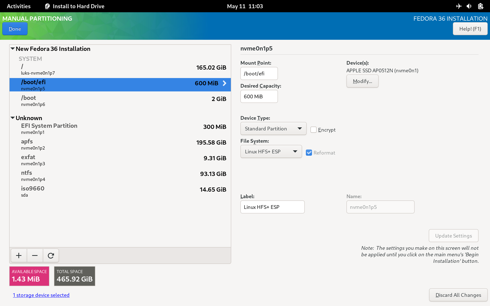

# mbp-fedora

[](https://github.com/mikeeq/mbp-fedora/actions/workflows/build-iso.yml)

Fedora ISO with Apple T2 patches built-in (Macbooks produced >= 2018).

All available Apple T2 drivers and patches are integrated into this ISO.

Kernel: <https://github.com/mikeeq/mbp-fedora-kernel>

Kernel patches: <https://github.com/t2linux/linux-t2-patches>

> Tested on: Macbook Pro 15,2 13" 2019 i5 TouchBar Z0WQ000AR MV972ZE/A/R1 && Macbook Pro 16,2 13" 2020 i5

```
Boot ROM Version:	220.270.99.0.0 (iBridge: 16.16.6571.0.0,0)
macOS Mojave: 10.14.6 (18G103)
```

## How to install

- Turn off secure boot and allow booting from external media - <https://support.apple.com/en-us/HT208330>
- Download .iso from releases section - <https://github.com/mikeeq/mbp-fedora/releases/latest>
  - If it's split into multiple zip parts, i.e.: `livecd.zip` and `livecd.z01` you need to download all zip parts and then
    - join split files into one and then extract it via `unzip`
      - <https://unix.stackexchange.com/questions/40480/how-to-unzip-a-multipart-spanned-zip-on-linux>
    - or extract downloaded zip parts directly using:
      - on Windows `winrar` or other supported tool like `7zip`
      - on Linux you can use `p7zip`, `dnf install p7zip` and then to extract `7za x livecd.zip`
      - on MacOS you can use
        - `the unarchiver` from AppStore: <https://apps.apple.com/us/app/the-unarchiver/id425424353?mt=12>
        - or you can install `p7zip` via `brew` `brew install p7zip` and use `7za x livecd.zip` command mentioned above
          - to install `brew` follow this tutorial: <https://brew.sh/>
- Next you can check the SHA256 checksum of extracted .ISO to verify if your extraction process went well
  - MacOS: `shasum -a 256 livecd-fedora-mbp.iso`
  - Linux `sha256sum livecd-fedora-mbp.iso`
  - please compare it with a value in `sha256` file available in github releases
- Burn the image on USB stick >=8GB via:
  - Fedora Media Writer
    - Download: <https://getfedora.org/en/workstation/download/>
      - MacOS <https://getfedora.org/fmw/FedoraMediaWriter-osx-latest.dmg>
        - if you're prompted that application is insecure/from unknown developer, check <https://support.apple.com/en-us/HT202491>
      - Windows <https://getfedora.org/fmw/FedoraMediaWriter-win32-latest.exe>
    - Please use Custom Image option when burning the downloaded and extracted ISO to USB drive
  - `dd`
    - Linux `sudo dd bs=4M if=/home/user/Downloads/livecd-fedora-mbp-201908181858.iso of=/dev/sdc conv=fdatasync status=progress`
    - MacOS
      - try to find under which `/dev/` your USB stick is available `sudo diskutil list`
      - check if any partitions from it are mounted `df -h`, if they are please unmount `sudo diskutil unmount /dev/disk2s1`
      - exec `sudo dd if=/Users/user/Downloads/livecd-fedora-mbp-201908181858.iso of=/dev/disk2 bs=4m`
      - if `dd` is not working for you for some reason you can try to install `gdd` via `brew` and use GNU dd command instead `sudo gdd bs=4M if=/Users/user/Downloads/livecd-fedora-mbp-201908181858.iso of=/dev/disk2 conv=fdatasync status=progress`

        ```bash
        # To install gdd via brew, execute
        brew install coreutils
        ```

      - don't worry if `dd` command execution is slow on MacOS, it can take a while due to XNU's poor I/O performance
  - `Rufus` (GPT)- <https://rufus.ie/>, if prompted use DD mode
  - Please don't use `livecd-iso-to-disk` as it's overwriting ISO default grub settings and Fedora will not boot correctly!
- Install Fedora
  - First of all I recommend to shrink (resize) macOS APFS partition and not removing macOS installation entirely from your MacBook, because it's the only way to keep your device up-to-date. macOS OS updates also contains security patches to EFI/Apple T2
    - HowTo: <https://www.anyrecover.com/hard-drive-recovery-data/resize-partition-mac/> # Steps to Resize Mac Partition
  - Boot Fedora Installer from USB drive directly from macOS boot manager. (You can boot into it by pressing and holding Option key (ALT key) after clicking the power-on button when your computer was turned off or on restart/reboot when Apple logo is shown on the screen).
    - There will be two/three boot options available, usually the last one works for me. (There are multiple boot options, because there are three different partitions in the ISO to make the ISO bootable on different set of computers: 1) ISO9660: with installer data, 2) fat32, 3) hfs+)
  - I recommend using standard partition layout during partitioning your Disk in Anaconda (Fedora Installer) as I haven't tested other scenarios yet. <https://github.com/mikeeq/mbp-fedora/issues/2

    - please create a separate partition for Linux EFI (Linux HFS+ ESP) as Anaconda installer requires separate partition on Mac devices, and it'll be reformatted to EFI (FAT32) during post-install scripts Anaconda's step (at the end of installation process).

    ```bash
      /boot/efi - 600MiB Linux HFS+ ESP
      /boot - 2GiB EXT4
      / - xxxGiB EXT4
    ```
    > You can leave the desired capacity value empty for the last partition, Anaconda will allocate all free disk space to that partition when defining it.

    

- To install additional languages (only English is available out of the box), install appropriate langpack via dnf `dnf search langpacks`, i.e.: to install Polish language pack execute: `dnf install langpacks-pl`
- You can change mappings of ctrl, option keys (PC keyboard mappings) by creating `/etc/modprobe.d/hid_apple.conf` file and recreating grub config. All available modifications could be found here: <https://github.com/free5lot/hid-apple-patched>

  ```bash
  sudo -i

  # /etc/modprobe.d/hid_apple.conf
  options hid_apple swap_fn_leftctrl=1
  options hid_apple swap_opt_cmd=1

  # Refresh dracut (initramfs)
  dracut -f
  ```

- To change function key mappings for models with touchbar see `modinfo apple_ib_tb` and use `echo 2 > /sys/class/input/*/device/fnmode` instead of the `hid_apple` options. See
    [this issue](https://github.com/mikeeq/mbp-fedora-kernel/issues/12)
- Setup wifi and other model specific devices by following guides on `wiki.t2linux.org` - <https://wiki.t2linux.org/guides/wifi/>

## How to upgrade current mbp-fedora installations

```bash
# Docs: https://docs.fedoraproject.org/en-US/quick-docs/dnf-system-upgrade/
sudo -i

# 1. Make sure your OS is up to date
dnf update -y --refresh
reboot

# 2. Update mbp-fedora-kernel
## update_kernel_mbp has built-in selfupgrade function, so when it fails it's just due to script update - please rerun everything should be good on second run
KERNEL_VERSION="6.0.9-f37" UPDATE_SCRIPT_BRANCH="v6.0-f37" update_kernel_mbp
reboot

# 3. Update your OS to include all changes made in mbp-fedora-t2-config RPM
dnf update -y --refresh
reboot

# 4. Install dnf-plugin-system-upgrade
dnf install -y dnf-plugin-system-upgrade

# 5. Upgrade to new OS version
## If you're trying to upgrade older version of mbp-fedora to latest version, please repeat a process by upgrading only to one major release of Fedora, i.e.: Fedora 33 -> 34, 34 -> 35, 35 -> 36, 36 -> 37, by changing the number in `--releasever` argument

dnf system-upgrade download -y --releasever=37

# 6. Reboot your Mac
dnf system-upgrade reboot

# 7. After reboot clean old packages
dnf clean packages

## 7.1 Clean all dnf cache
dnf clean all

## 8. Clean all unneeded packages
dnf autoremove -y

## 9. Update your new version of Fedora
dnf update -y --refresh
reboot
```

## Not working

- TouchID - (@MCMrARM is working on it - https://github.com/Dunedan/mbp-2016-linux/issues/71#issuecomment-528545490)
- Audio
  - Microphone (it's recognized with new apple t2 sound driver, but there is a low mic volume amp)

## TODO

- disable iBridge network interface (awkward internal Ethernet device?)

  ```bash
  echo "# Disable Unused Apple Ethernet
  blacklist cdc_ncm
  blacklist cdc_mbim" | sudo tee -a /etc/modprobe.d/blacklist.conf
  ```

- disable not working camera device
  - there are two video devices (web cameras) initialized/discovered, don't know why yet

    ```bash
    ➜ ls -l /sys/class/video4linux/
    total 0
    lrwxrwxrwx. 1 root root 0 Aug 23 15:14 video0 -> ../../devices/pci0000:00/0000:00:1d.4/0000:02:00.1/bce/bce/bce-vhci/usb7/7-2/7-2:1.0/video4linux/video0
    lrwxrwxrwx. 1 root root 0 Aug 23 15:14 video1 -> ../../devices/pci0000:00/0000:00:1d.4/0000:02:00.1/bce/bce/bce-vhci/usb7/7-2/7-2:1.0/video4linux/video1
    ➜ cat /sys/class/video4linux/*/dev
    81:0
    81:1
    ```

## Known issues

- Kernel/Mac related issues are mentioned in kernel repo
- Anaconda sometimes could not finish installation process and it's freezing on `Network Configuration` step, probably due to iBridge internal network interface

> workaround - it's a final step of installation, just reboot your Mac (installation is completed)

- Macbooks with Apple T2 can't boot EFI binaries from HFS+ formatted ESP - only FAT32 (FAT32 have to be labelled as msftdata).

> workaround applied - HFS+ ESP is reformatted to FAT32 in post-scripts step and labelled as `msftdata`

- `ctrl+x` is not working in GRUB, so if you are trying to change kernel parameters - start your OS by clicking `ctrl+shift+f10` on external keyboard

## Docs

- Discord: <https://discord.gg/Uw56rqW>
- T2 Wiki: <https://wiki.t2linux.org/>
- WiFi firmware: <https://github.com/AdityaGarg8/Apple-Firmware>

### Fedora

- <https://fedoraproject.org/wiki/LiveOS_image>
- <https://docs.fedoraproject.org/en-US/quick-docs/creating-and-using-a-live-installation-image/>
- <https://pykickstart.readthedocs.io/en/latest/kickstart-docs.html#chapter-1-introduction>
- <https://forums.fedoraforum.org/showthread.php?309843-Fedora-24-livecd-creator-fails-to-create-initrd>
- <https://fedoraproject.org/wiki/QA/Test_Days/Live_Image>
- <https://fedoraproject.org/wiki/How_to_create_a_Fedora_install_ISO_for_testing>

### Github

- GitHub issue (RE history): <https://github.com/Dunedan/mbp-2016-linux/issues/71>
- @kekerby T2 Audio Config: <https://github.com/kekrby/t2-better-audio>
- Apple BCE repository (Apple T2 HID): <https://github.com/kekrby/apple-bce.git>
- Apple iBridge repository (TouchBar): <https://github.com/Redecorating/apple-ib-drv.git>

- hid-apple-patched module for changing mappings of ctrl, fn, option keys: <https://github.com/free5lot/hid-apple-patched>
- Linux T2 kernel patches: <https://github.com/t2linux/linux-t2-patches>
- Ubuntu
  - Kernel <https://github.com/t2linux/T2-Ubuntu-Kernel>
  - ISO <https://github.com/AdityaGarg8/T2-Ubuntu>
- Arch Linux
  - Kernel <https://github.com/Redecorating/linux-t2-arch>
  - Packages <https://github.com/Redecorating/archlinux-t2-packages>
  - ISO <https://github.com/t2linux/archiso-t2>

### Old

- VHCI+Sound driver (Apple T2): <https://github.com/MCMrARM/mbp2018-bridge-drv/>
- AppleSMC driver (fan control): <https://github.com/MCMrARM/mbp2018-etc/tree/master/applesmc>
- hid-apple keyboard backlight patch: <https://github.com/MCMrARM/mbp2018-etc/tree/master/apple-hid>
- TouchBar driver: <https://github.com/roadrunner2/macbook12-spi-driver/tree/mbp15>

### Other

- blog `Installing Fedora 31 on a 2018 Mac mini`: <https://linuxwit.ch/blog/2020/01/installing-fedora-on-mac-mini/>
- iwd:
  - <https://iwd.wiki.kernel.org/networkconfigurationsettings>
  - <https://wiki.archlinux.org/index.php/Iwd>
  - <https://www.vocal.com/secure-communication/eap-types/>

## Credits

- @MCMrARM - thanks for all RE work
- @ozbenh - thanks for submitting NVME patch
- @roadrunner2 - thanks for SPI (touchbar) driver
- @aunali1 - thanks for Kernel Patches
- @ppaulweber - thanks for keyboard and Macbook Air patches
- @AdityaGarg8 - thanks for support and upkeeping kernel patches
- @kekrby for T2 Audio config
- @Redecorating for Arch support
